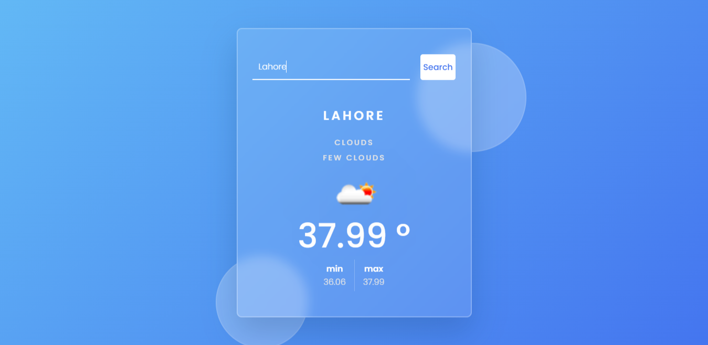

# WeatherApp-using-JS

This is a simple weather application that allows users to search for weather details of a specific city. The app retrieves data from the OpenWeatherMap API and displays the current temperature, weather conditions, and other relevant information.

## Features

- Search Bar: Users can enter the name of a city in the search bar to retrieve weather information for that location.
- Search Button: Clicking the search button triggers the retrieval of weather data for the entered city.
- Enter Key: Pressing the enter key while the search bar is focused also triggers the retrieval of weather data.
- Weather Display: The retrieved weather data is dynamically displayed on the page, including the city name, weather condition, description, temperature, and min/max temperature values.
- Weather Icon: An icon representing the weather condition is displayed alongside the weather information.
- Error Handling: If the entered city name is not found or if no city name is entered, appropriate error messages are displayed.

## Technologies Used

- HTML
- CSS
- JavaScript

## How to Use

1. Clone the repository or download the project files.
2. Open the `index.html` file in a web browser.
3. Enter the name of a city in the search bar and click the search button or press enter.
4. The weather information for the specified city will be displayed on the page.

Note: To fetch weather data, you need to provide an API key from OpenWeatherMap. Replace the placeholder value `"xxxxxxxxxxxxxxxxxxxxxx"` in the `key.js` file with your actual API key.

## Preview

## Acknowledgments

- [OpenWeatherMap](https://openweathermap.org/) - Weather data API provider.

## License

This project is licensed under the [MIT License](LICENSE).
